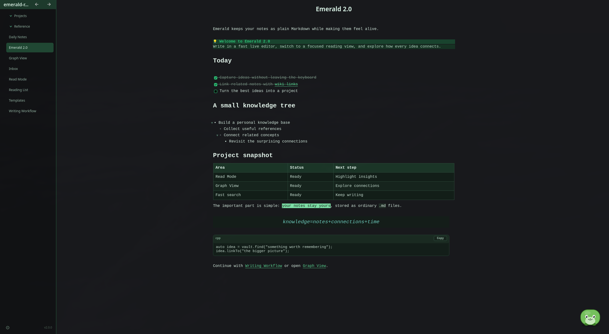
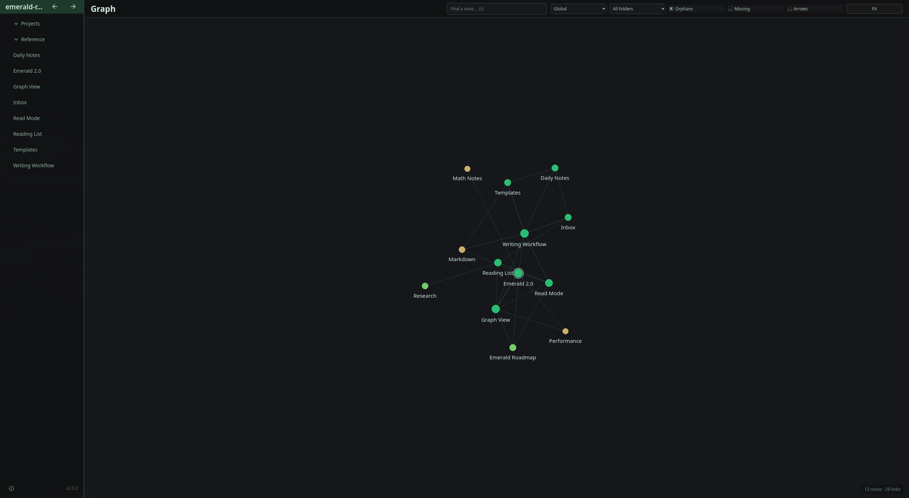

<div align="center">


# Emerald

**A tiny, fast, Obsidian-style Markdown notes app.**

Plain `.md` files · inline live preview · local spell check · Linux · macOS · Windows

[](https://github.com/MinottiAlessandro/Emerald/actions/workflows/release.yml)
[](https://github.com/MinottiAlessandro/Emerald/releases/latest)
[](https://github.com/MinottiAlessandro/Emerald/releases)


[](LICENSE)

</div>

<p align="center">
  <a href="https://ko-fi.com/alessandromino">
    
  </a>
</p>

---

## Emerald at a glance

<p align="center">
  
  <br>
  <sub>Read Mode turns plain Markdown into a focused view with callouts, tasks, tables, math, code, wiki links, and more.</sub>
</p>

<p align="center">
  
  <br>
  <sub>Explore the whole vault—or a note's local neighborhood—in the same workspace with Graph View.</sub>
</p>

---

## Download

Grab the latest build for your platform — **self-contained, no Qt installation required.**

| Platform | Download | Notes |
|---|---|---|
| 🐧 **Linux** (x86-64) | [`Emerald-x86_64.AppImage`](https://github.com/MinottiAlessandro/Emerald/releases/latest/download/Emerald-x86_64.AppImage) | `chmod +x` then run |
| 🐧 **Linux** (ARM64) | [`Emerald-aarch64.AppImage`](https://github.com/MinottiAlessandro/Emerald/releases/latest/download/Emerald-aarch64.AppImage) | `chmod +x` then run · needs glibc ≥ 2.39 |
| 🍎 **macOS** (universal) | [`Emerald-macOS.dmg`](https://github.com/MinottiAlessandro/Emerald/releases/latest/download/Emerald-macOS.dmg) | first launch: **right-click → Open → Open** |
| 🪟 **Windows** | [`Emerald-win64-setup.exe`](https://github.com/MinottiAlessandro/Emerald/releases/latest/download/Emerald-win64-setup.exe) | installer; registers Markdown “Open with” support |

The Windows release also includes a portable `Emerald-win64.zip`. Portable
builds do not register file associations because their executable may be moved.

Every release also includes `SHA256SUMS` for manual package verification. The
in-app updater checks GitHub's published SHA-256 digest and package size before
it opens or installs a download.

> Every download bundles its own Qt runtime, so there's nothing else to install. Looking for older versions? See **[all releases](https://github.com/MinottiAlessandro/Emerald/releases)**.

> **macOS note:** the app is ad-hoc signed but not notarized (no paid Apple
> Developer ID), so the first launch needs **right-click → Open → Open**. If
> macOS still blocks it, clear the download quarantine in Terminal:
> ```bash
> xattr -cr /Applications/Emerald.app
> ```

---

## Why Emerald

- 🗂️ **Your notes are just files.** A vault is a folder of `.md` files — no database, no lock-in, fully Obsidian-compatible.
- 📄 **Or open one file.** Double-click a `.md`/`.markdown` document, choose Emerald from **Open with**, or run `emerald path/to/file.md` for an isolated editor that does not scan its folder.
- ✨ **Live preview, in place.** Markdown renders as you type; the syntax markers melt away on every line except the one you're editing.
- 🔗 **Real `[[wiki-links]]`** with fuzzy autocomplete, auto-creation, and rename-aware backlink rewriting.
- 🕸️ **A fast, in-pane Graph View** for exploring the links and neighborhoods across a vault without opening another window.
- 🔍 **Instant full-text search** over the whole vault, backed by an in-memory inverted index.
- 🧮 **Math, built in.** Inline `$…$` and display `$$…$$` LaTeX render live — fractions, roots, matrices, accents — with no extra dependencies.
- 🐾 **A mascot per note.** Each note can grow its own little procedurally drawn creature in the corner — a memorable face to recall it by.
- 🪶 **Tiny dependency footprint.** Qt 6 plus a private Hunspell engine; built to stay small, fast, local, and maintainable.

---

## Features

**Editing & live preview**
- Headings, **bold**, *italic*, ***both***, `code`, ~~strike~~, ==highlight==, `> quotes`, `---` rules, `- [ ]` task lists, fenced ` ``` ` code blocks (with language tag) and `[[wiki|links]]` all render in place.
- **Obsidian-style callouts** — start a quote with `> [!tip]` (or add a custom title after the marker) to turn the whole quote group into a continuous, type-colored callout in Edit and Read modes. Each supported type has its own emoji, the title is bold, and the top-level card stays on the normal left content edge without changing the Markdown source.
- **Overlapping emphasis** — bold / italic / strike / highlight nest and stack, so `==dog ~~cat *horse **elephant***~~==` layers all four styles incrementally.
- **HTML comments** — write private author notes with `<!-- comment -->`, inline or across multiple lines. Comments remain visible as subdued source in Edit Mode, but disappear entirely from Read Mode, search, spelling, Graph View, Quick Jump, broken-link checks, and rename propagation. The same text inside code or math stays literal.
- **Markdown images** — inline and reference-style images plus Obsidian `![[image.png]]` embeds render in Edit and Read Mode, including optional titles and size hints. Local paths remain vault-bounded; missing files use a compact fallback card.
- **Pipe tables** — Enter anywhere in the header or separator formats the table when it fits and starts at the first cell of the first data row, auto-creating missing structure; in a body row it moves to the same cell below, adding a row at the bottom when needed. Tab walks/grows the grid, and auto-alignment is skipped whenever its padded rows would exceed the editor width. Tables remain plain Markdown in Edit Mode, render semantically in Read Mode, and disappear completely with their folded section.
- **Smart lists** — Enter continues a bullet / numbered / task list (numbers increment, indentation preserved); pressing Enter mid-item splits the line, carrying the text after the caret onto a new marked item; Enter on an empty item ends it; Tab / Shift+Tab indent and outdent (a multi-line selection indents every line). Off the active line, dashes become real bullet glyphs (●/○/▪ by nesting level). Click a parent item's arrow to collapse or expand its complete child list in Edit or Read Mode.
- **Ctrl+Enter** starts a new line below without splitting the current one — and keeps the list going (or clears an empty bullet).
- **Wrap the selection** — select text and press `(`, `[`, `*`, `_`, `=`, `'`, `"`, `` ` ``, `~` or `$` to surround it (brackets close with their match; `$` wraps a multi-line selection as one span).
- **Folding** on heading sections, fenced blocks, and nested list trees.
- **Read Mode** — toggle it per vault from **Settings → Vault** or with `Ctrl+E` to render every line without a caret and block ordinary edits. Select text and press `Ctrl+Shift+H` to add or remove a persistent `==highlight==`; if any part of the selection is not highlighted, Emerald fills the gaps, otherwise it removes the selected highlight. Plain ↑/↓ scroll the page while search, including matches inside rendered code blocks, links, folding and text selection remain available. Switching between Read and Edit Mode preserves the same source-backed viewport anchor, so even rapidly toggling a wrapped list does not make the page drift.
- **Markdown-aware spell checking** — US English is included and works entirely offline. Misspelled prose is underlined incrementally without disturbing bold, links, or other live-preview styling; code, math, URLs, HTML, images, and wiki-link targets are skipped. Right-click a misspelling for corrections, **Add to personal dictionary**, or **Ignore for this session**. Settings can download independently verified Italian, German, French, and Spanish packs with visible percentage progress, activate several dictionaries together, and remember the language stack per vault.

**Math** *(no dependencies — a small built-in TeX-subset typesetter)*
- **Inline `$…$`** and **display `$$…$$`** render live in place; a `$$` block can span several lines (open/close on their own lines or carrying content), and the raw source reappears whenever the caret or selection is inside it. Bare dollars (`$5 and $12`) stay literal.
- **Fractions** `\frac` `\dfrac` `\tfrac`, **roots** `\sqrt`, super/subscripts with **stacked limits** on big operators (`\sum` `\prod` `\int` `\bigcup` …) in display mode, and `\binom`.
- **Accents** (`\hat \bar \vec \tilde \dot \ddot \widehat \overline`), **grown delimiters** `\left( … \right]`, **`\text` / `\textbf` / `\operatorname`**, **matrices** (`pmatrix` `bmatrix` `vmatrix` …), ~150 symbol commands (Greek, operators, relations, arrows), and full Unicode (emoji, CJK).

**Links & navigation**
- `[[Note]]` links are clickable (plain click once rendered, Ctrl+click on the line you're editing) and auto-create their target. `[[Note|alias]]` shows just the alias; `[[Note#Heading]]` and `[[#Heading]]` jump directly to headings. Typing `[[` pops a fuzzy autocomplete of existing titles and offers matching headings after `#`. Hold `Alt` for a moment to label every visible link, then type its QWERTY-ordered hint to open it without the mouse (`X` is reserved for the shortcuts panel).
- **External links** — `[text](https://…)` renders as a clickable link (the `](url)` melts away, leaving just the text) and opens in your browser.
- **Title = filename** — the note's title is the first line above the body; editing it renames the file and rewrites every inbound `[[link]]`.
- **Back / forward history** like a browser (`Alt+←` / `Alt+→`, mouse side buttons, or the sidebar arrows).
- **Graph View** — `Ctrl+Shift+G` replaces the current note inside the normal workspace with an interactive, dependency-free map of the vault. Pan, zoom around the pointer, drag nodes, search titles, filter by folder/orphan/missing status and incoming/outgoing direction, reveal arrows, and double-click a node (or select it and press Enter) to open its note. Global and depth-1–3 Local modes share browser history with notes, so Back restores the graph's camera, search, filters, and selection. Layout runs off the UI thread and stops when settled.

**Vault & search**
- **Standalone files** — open an individual `.md` or `.markdown` from the gear menu, command line, Finder/File Explorer, or a Linux file manager. It gets its own window and file watcher; Emerald neither scans nor indexes neighboring files and leaves the last-vault setting untouched. Existing relative images render, while vault-only search, graphs, templates, attachment copying, and note creation stay disabled.
- **Folder-tree sidebar** with drag-and-drop; right-click to create notes or sub-folders anywhere, and sort notes by name or modification time.
- **Telescope-style search popup** — ranked results, type to filter, ↑/↓ to move, Enter jumps to the first match. In-note and vault search both show the current match and total, like a browser find bar.
- **Broken Links** — `Ctrl+Shift+B` (or **Settings → Vault → Broken links**) opens a filterable report of every `[[wiki-link]]` whose target note is missing or empty. Each result shows its source and line; Enter opens and selects the exact link.
- **Templates** — point **Settings → Templates folder** at a folder in the vault, then **Insert Template…** (`Ctrl+T`) opens a quick picker of every note under it (sub-folders included) and drops the chosen one in at the caret. Templates can carry `{{date}}`, `{{time}}` and `{{title}}` placeholders — each filled in on insert; `{{date}}`/`{{time}}` take an optional Moment.js-style format after a colon (e.g. `{{date:YYYY/MM/DD}}`, `{{time:HH:mm:ss}}`).
- **Debounced autosave** plus **external-edit detection** — Emerald reloads notes changed outside the app. Each vault remembers its last note, while the vault switcher orders folders by recent activity and relaunch restores the last vault that was actually closed.

**Mascots**
- **A creature per note** — an optional, procedurally drawn mascot in the bottom-right corner, seeded from the note's title and text (rendered live from the seed by default — no image files needed). Around three dozen archetypes spanning ordinary animals, mythological creatures, and objects. Hover for a gentle blink and bob.
- **Gallery & control** — click a mascot (or press **Ctrl+G**) for a vault-wide **gallery** (click any creature to jump to its note). **Generate** (**Ctrl+M**) / **Delete** (**Ctrl+Shift+M**) from the gear menu; auto-generation once a note passes a character count is opt-in under **Settings → Mascot**. Deleting a note's mascot stops auto-generation from recreating it for that note — generate one by hand (**Ctrl+M**) to resume. **Clear all mascots** removes every mascot seed from the open vault and turns automatic generation off.
- **Bring your own creatures** — drop a folder of SVGs into your mascots folder (`creatures/<name>/body.svg`, plus optional `topper`/`eyes`/`mouth`/… layers) and Emerald discovers it and starts rolling your creature into the mix alongside the built-ins — no rebuild. The chosen creature is recorded in the note so it stays reproducible and travels with the file, falling back to a built-in on a machine that doesn't have the art.
- **Or bring your own images** — prefer hand-drawn or AI-generated art? Drop square images (PNG/JPG/WEBP) into an `images/` folder inside your mascots folder and switch on **Use Image Mascots** in the gear menu. Each note then shows one of your images — picked deterministically by its seed — as a rounded tile instead of the procedural creature. Like custom creatures, the images live on your machine (not in the vault), so a note falls back to its procedural mascot where the images aren't present.
- **Stored in the note itself** — the seed lives in a hidden first line (`<!-- mascot: … -->`), invisible in any other Markdown viewer, so mascots travel with your notes and leave no separate metadata behind. Press **↑** at the top of a note to reveal the line; edit or delete the seed by hand and the creature follows.

**Polish**
- **No menubar** — a gear at the bottom of the sidebar holds settings and file actions; everything has a shortcut.
- **Hold-to-view shortcut cheatsheet** — keep `Alt+X` pressed for a centered, categorized reference, then release either key to dismiss it without losing focus.
- **Responsive layout** — at narrow widths, the folder tree and editor become separate full-width views with compact Notes/Editor navigation and always-available new-note, search, and gear controls.
- **Adjustable editor font** (family + size, persisted), fixed or full-width columns, and **line spacing**; heading sizes scale with the font.
- **Smooth scrolling** — mouse-wheel steps ease between pixel positions; high-resolution trackpad deltas remain native and direct, and Read Mode's ↑/↓ movement uses the same pixel-based viewport.
- **Self-updating** — **Check for Updates…** pulls the latest release from GitHub and installs in place on macOS and Linux AppImage builds. After an upgrade, Emerald opens an offline **What's New** panel once; the same notes remain available from the gear menu.
- **Application themes** — switch between the built-in Dark and Light palettes or create named custom themes with a live preview and per-role colors.

---

## Keyboard shortcuts

> On macOS, use **⌘** where **Ctrl** is listed.

| Action | Shortcut |
|---|---|
| Open vault | `Ctrl+O` |
| Switch vault | `Ctrl+Shift+O` |
| New note | `Ctrl+N` |
| Go to note (quick open) | `Ctrl+P` |
| Insert template | `Ctrl+T` |
| Insert image attachment | `Ctrl+Shift+I` |
| Save now | `Ctrl+S` |
| Rename note | `F2` |
| Delete note | `Ctrl+Shift+Backspace` |
| Find in note | `Ctrl+F` |
| Search vault | `Ctrl+Shift+F` |
| Review broken links | `Ctrl+Shift+B` |
| Open Graph View | `Ctrl+Shift+G` |
| Toggle Read Mode | `Ctrl+E` |
| Toggle selected Read Mode highlight | `Ctrl+Shift+H` |
| Settings | `Ctrl+,` |
| Back / Forward | `Alt+←` / `Alt+→` |
| Quick Jump to visible link | Hold `Alt`, then type its hint |
| Show shortcut cheatsheet | Hold `Alt+X`; release either key to close |
| Bold / Italic | `Ctrl+B` / `Ctrl+I` |
| Insert link | `Ctrl+K` |
| Heading level 1–6 (press again to clear) | `Ctrl+1` … `Ctrl+6` |
| Select line | `Ctrl+L` |
| Move line up / down | `Alt+↑` / `Alt+↓` |
| Indent / outdent list item | `Tab` / `Shift+Tab` |
| Font size up / down / reset | `Ctrl++` / `Ctrl+-` / `Ctrl+0` |
| Toggle sidebar | `Ctrl+\` |
| Mascot gallery | `Ctrl+G` |
| Generate mascot | `Ctrl+M` |
| Delete mascot | `Ctrl+Shift+M` |
| Quit | `Ctrl+Q` |

> `Ctrl+Delete` stays the usual delete-word-forward; Delete note is the deliberate `Ctrl+Shift+Backspace`.

---

## Build from source

Requires **Qt 6**, a **C++20** compiler, and **CMake ≥ 3.21**. Emerald vendors
the reviewed Hunspell 1.7.3 source snapshot and its pinned English dictionary,
so configuration and compilation never download dependencies or vary with the
host's installed Hunspell version. The finished application needs no network
connection for English spell checking.

```bash
cmake -S . -B build -DCMAKE_BUILD_TYPE=Release
cmake --build build -j
./build/emerald
```

Open a vault with `Ctrl+O` and create your first note with `Ctrl+N`.

Spelling dependency provenance, offline verification, and the review-first
update/release process are documented in
[`docs/SPELLING_DEPENDENCIES.md`](docs/SPELLING_DEPENDENCIES.md).

The widget backing store is composited on the GPU by default (Qt's RHI path) for
smooth resizing; set `QT_WIDGETS_RHI=0` to fall back to CPU raster.

### Packaging

The build produces platform-native packages via the install rules and CPack:

```bash
  cmake --install build --prefix dist     # system-style install (Linux), .app (macOS), windeployqt (Windows)
  cd build && cpack                        # → .tar.gz (Linux) / .dmg (macOS) / .zip (Windows)
./packaging/linux/make_appimage.sh       # portable Linux AppImage (via linuxdeploy)
```

Tagging a `vX.Y.Z` release triggers the [GitHub Actions workflow](.github/workflows/release.yml),
which builds all three platforms and attaches the packages to the release.

---

## Architecture

```
core/   no GUI, unit-testable (depends only on QtCore)
  Vault            scan a folder, read/write .md files, resolve link targets
  VaultSettings    per-vault preferences in the platform settings store
  SearchIndex      inverted index for fast full-text search
  WikiLink         the shared [[wiki-link]] pattern + target cleaning
  MarkdownWikiLinkScanner semantic link discovery outside code spans/fences
  LinkGraphIndex   compact incremental directed note graph
  SpellChecker     Hunspell wrapper, Markdown word ranges, personal/pack storage
  Note             { path, title }
ui/     Qt Widgets
  MainWindow       folder tree + in-pane note/graph pages; autosave, typed history, rename
  GraphView        custom QPainter canvas + background force layout
  MarkdownEditor   QTextEdit + pixel scrolling, clickable links, [[ autocomplete, lists, folding
  MarkdownHighlighter   inline live preview (conceals markers off the active line)
  SpellLanguageDialog  verified optional-dictionary downloads and removal
  SearchPopup      centered Telescope-style search overlay
```

The `core/` layer is GUI-free, so the vault and link logic can be tested without a display.

---

## License

Released under the [MIT License](LICENSE) — © 2026 Alessandro Minotti.
